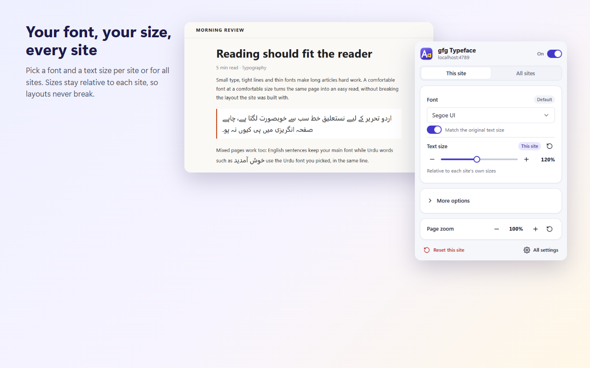

# gfg Typeface

gfg Typeface changes how text looks on the web: pick a font, a text size, line spacing and weight for each site or for all sites, and give languages such as Urdu, Arabic, Hindi or Chinese their own font. Text sizes stay relative to each site's own sizes, so page layouts keep working.



## Features

- **Fonts per site or for all sites.** Choose from the fonts installed on your computer. Sites without their own settings use your all-sites defaults; each site can override any setting or be switched off.
- **Text size relative to the site.** 120% makes every piece of text 20% larger than the site made it, from headings to footnotes. Computed sizes and layout boxes stay untouched, so menus, grids and fixed headers keep their shape.
- **Matched replacement fonts.** With "Match the original text size" on, a replacement font is sized so its lowercase letters are as tall as the font it replaces. Text keeps its visual size when you swap fonts.
- **Language fonts.** Set a font and a size per language. The font applies to every letter of that language, even inside English sentences; the size applies to paragraphs written in that language. Urdu, Arabic and Persian share a script, so the extension tells them apart by the page's `lang` attributes and by letters only one of them uses.
- **Line spacing and weight.** Scale line spacing from 80% to 200% and make text lighter or bolder. Weight changes depend on the weights a font provides.
- **Code font.** Replace monospace fonts in code blocks, or keep the site's own.
- **Icons stay intact.** Icon fonts (Font Awesome, Material Symbols and others), emoji and private-use glyphs keep their fonts.
- **Page zoom.** The popup controls the browser's own per-site zoom, the same zoom as Ctrl + and Ctrl -.
- **Live preview.** Changes show on the page while you drag a slider.
- **Everywhere on the page.** Works in iframes, open and closed shadow DOM (web components such as Reddit's), pages that load content as you scroll, and pages with strict Content Security Policies.

## Install

Install from the Chrome Web Store (link added on publication), or load a build:

1. Download `gfg-typeface-<version>-chrome.zip` from the releases page and unzip it, or build it yourself (see [Development](#development)).
2. Open `chrome://extensions` (or `edge://extensions`) and turn on **Developer mode**.
3. Click **Load unpacked** and select the unzipped folder.

gfg Typeface runs in Chrome, Edge, Brave, Opera, Vivaldi and other Chromium browsers, version 133 or newer. Firefox is not supported: it has no API for listing installed fonts.

## Usage

Click the toolbar button to open the popup.

- **This site / All sites** chooses what you edit. In "This site", each setting shows **This site** when the site overrides it or **Default** when it comes from the all-sites defaults; the reset button next to an override returns it to the default.
- The switch in the header turns changes on or off for the site, or pauses the all-sites defaults.
- **More options** holds line spacing, weight, the code font and language fonts.
- **All settings** opens the settings page with every site that has its own settings, plus import, export and reset.

The toolbar badge shows **ON** in blue when the site has its own settings and in gray when the all-sites defaults apply.

### Keyboard shortcuts

| Shortcut | Action |
| --- | --- |
| Alt+Shift+F | Turn changes on or off for the current site |
| Alt+Shift+Up | Text 10% larger on the current site |
| Alt+Shift+Down | Text 10% smaller on the current site |
| Alt+Shift+0 | Reset text size on the current site |

Change them at `chrome://extensions/shortcuts`. Right-clicking a page or the toolbar button also offers **Change fonts on this site** and **All settings**.

## How it works

The content script tags only the elements where a site's own typography changes (a heading that sets its own font, a code block, an input) and leaves everything else to CSS inheritance. All settings become CSS custom properties in one constructed stylesheet that is adopted into the page and every shadow root, so pages with strict Content Security Policies work the same.

Text size uses `font-size-adjust: ic-width`, which scales the glyphs of every font in a run by the same factor without changing the computed `font-size`. Nested `em` sizes don't compound, sizes set with `clamp()` or viewport units keep responding to the window, and pages that change sizes later stay correct. Line heights are scaled alongside so lines never overlap.

Language fonts are `@font-face` rules limited by `unicode-range` to the language's script, placed before your main font. That gives every glyph of that script the language font, the way iPhones mix Urdu and English.

Work runs before the browser paints, so changed pages appear without a flash of the original fonts. Large pages are processed in slices so scrolling stays smooth.

## Permissions

| Permission | Why |
| --- | --- |
| Access to all sites | Apply your fonts on the sites you visit. |
| `storage` | Save your settings in your browser account so they sync between your devices. |
| `fontSettings` | List the fonts installed on your computer. |
| `scripting` | Apply settings to tabs that were already open when the extension was installed or updated. |
| `contextMenus` | The right-click menu entries. |

## Privacy

Settings, including the host names of sites you configure, are stored in your browser's sync storage. Nothing is sent anywhere else. See [PRIVACY.md](PRIVACY.md).

## Limitations

- Browsers don't let extensions change their own pages (`chrome://`, the Chrome Web Store).
- Apps that draw text on a canvas, such as Google Docs and Google Sheets, are not affected.
- Boxes sized in `em` or `ch` keep their size while the text inside grows.
- Per-language text size applies to whole paragraphs in that language. A Urdu word inside an English paragraph gets the Urdu font at the paragraph's size.
- Fonts and line heights that a site changes only on hover keep their resting values.
- A site's inline `!important` font rules, and `!important` rules in cascade layers that the site declares before the extension's own, win over your settings.
- Browser sync storage holds settings for about 500 sites.

## Upgrading from gfg Font Changer 3.x

Settings from 3.x move over on update: each site's font is kept, and the pixel size change becomes a percentage of a 16 px base (+2 px becomes 115%). The old page scaling setting is not carried over; page zoom now uses the browser's own per-site zoom, which keeps its own settings.

## Development

Requirements: Node.js 22 or newer.

```bash
npm install
```

```bash
npm run dev
```

`npm run dev` opens a browser with the extension loaded and reloads it on changes. Other scripts:

| Script | Purpose |
| --- | --- |
| `npm run build` | Production build in `.output/chrome-mv3` |
| `npm run zip` | Store-ready zip in `.output/` |
| `npm run typecheck` | TypeScript checks |
| `npm run lint` | ESLint |
| `npm test` | Unit tests (Vitest) |
| `npm run test:e2e` | Builds, then runs end-to-end tests in Playwright's Chromium with the extension loaded |
| `npm run icons` | Renders `assets/icon.svg` to `public/icon/*.png` |
| `npm run store-assets` | Renders store screenshots and the promo tile to `store/assets/` |

End-to-end tests use local fixture pages served by `tests/e2e/server.mjs` and never contact live sites. They need Playwright's Chromium (`npx playwright install chromium`); branded Chrome ignores unpacked extensions loaded from the command line.

### Project layout

```
src/
  entrypoints/   background service worker, content scripts, popup and settings page
  engine/        the content-side engine: boundary detection, CSS builder, traversal, font metrics
  lib/           settings model, storage, languages, fonts, site keys, commands
  ui/            shared design tokens and components used by the popup and settings page
tests/unit/      Vitest unit tests
tests/e2e/       Playwright tests and fixture pages
store/           Chrome Web Store listing text and assets
```
